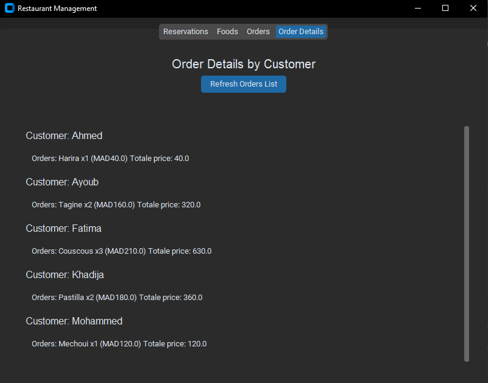

# Restaurant Management System

## Overview
The **Restaurant Management System** is a Python desktop application designed to streamline restaurant operations. This project uses **customTkinter** for an intuitive graphical user interface (GUI) and **SQLite** for database management. The system allows restaurant staff to manage menus, orders, and customer information efficiently.

---

## Features
- **Modern GUI**: A sleek interface built using `customTkinter`.
- **Database Management**: Persistent data storage using `SQLite`.
- **Pre-configured Setup**: Automated database creation and initialization.
- **Order Management**: Seamless tracking and management of orders.
- **Menu Management**: Add or delete menu items.
- **Customer Records**: Maintain customer information for loyalty programs or analytics.

---

## Project Structure
```
RestaurantManagementSystem/
|-- db_setup.py
|-- init_db.py
|-- restaurant_management.py
|-- README.md
```
### File Descriptions
1. **`db_setup.py`**:
   - Creates the database structure.
   - Defines tables such as `menu`, `orders`, and `customers`.

2. **`init_db.py`**:
   - Populates the database with sample data.
   - Useful for testing and demonstration purposes.

3. **`restaurant_management.py`**:
   - Contains the main application logic and methods.
   - Implements the GUI using `customTkinter`.

---

## Installation
### Prerequisites
- Python 3.8+
- Required libraries:
  - `customTkinter`
  - `sqlite3` (built-in with Python)

### Steps
1. Create the repository:
   ```bash
   cd RestaurantManagementSystem
   ```
2. Install dependencies:
   ```bash
   pip install customtkinter
   ```
3. Run the setup scripts:
   ```bash
   python db_setup.py
   python init_db.py
   ```
4. Launch the application:
   ```bash
   python restaurant_management.py
   ```

---

## Usage
1. Launch the application using the instructions above.
2. Use the menu options to manage orders, menu items, and customer data.
3. All changes are saved automatically in the SQLite database.

---

## Screenshots
### Main Interface


### Menu Management


### Order Management


### Order Details 


